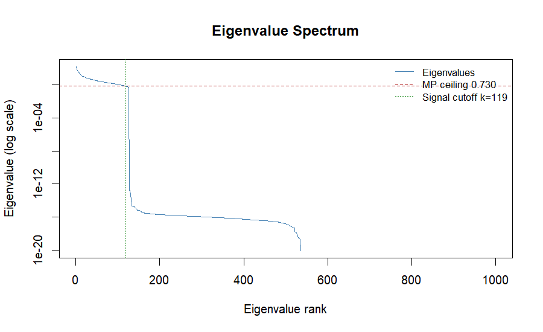
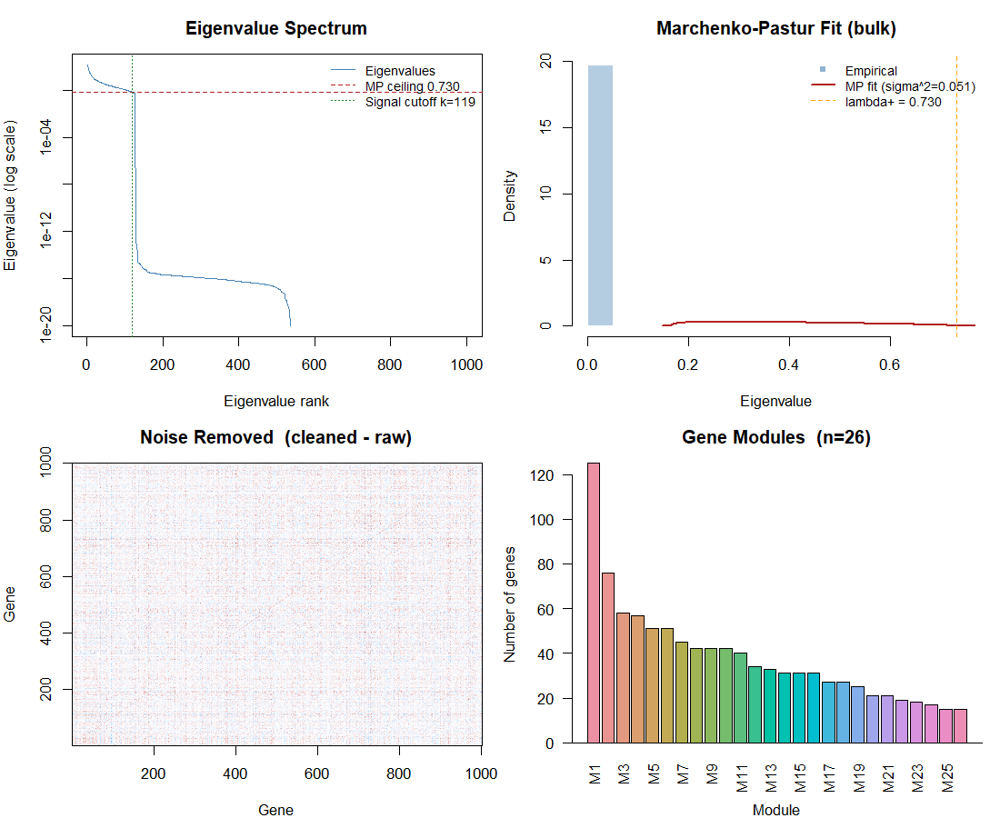

# RMTnet

**Parameter-free gene co-expression networks using Random Matrix Theory.**

RMTnet builds gene co-expression networks without any parameters to tune. Where WGCNA requires you to pick a soft-thresholding power β by eyeballing a plot — a choice that varies between analysts and datasets — RMTnet derives its threshold mathematically from your data using the **Marchenko-Pastur law**. Same data in, same answer every time.

---

## Origin

While working on a class project I came across Random Matrix Theory and how it separates genuine statistical signal from finite-sample noise. I realised the math maps directly onto gene co-expression analysis — both problems reduce to the same thing: a large correlation matrix with too few samples. After surveying existing approaches (Luo et al. 2007, RMTGeneNet 2013, RMThreshold on CRAN), I found none offered a Bioconductor-integrated, WGCNA-shaped workflow built on spectral filtering rather than hard thresholding. So I built one.

---

## Installation

```r
# Install from GitHub (requires remotes)
install.packages("remotes")
remotes::install_github("Febo2788/RMTnet")
```

> Bioconductor submission is pending. Once accepted, installation will also be available via `BiocManager::install("RMTnet")`.

---

## Quick start

```r
library(RMTnet)

# Any normalised expression matrix (genes × samples) — same input as WGCNA
net <- rmt_network(mat)
print(net)
plot(net)
```

One function call. No β to pick, no R² plot to eyeball, no parameters.

---

## How it works

### The problem with WGCNA

```r
# WGCNA — you must pick this number by eye
powers <- c(1:20)
sft    <- pickSoftThreshold(expr, powerVector = powers)
plot(sft$fitIndices[,1], sft$fitIndices[,2])
# ... squint at plot, pick where R² > 0.8 ... subjective
blockwiseModules(expr, power = 12)  # why 12? ask the analyst
```

Different analyst, different β, different network.

### RMTnet — zero parameters

Imagine your genes were completely random — no real biology at all. If you computed their correlation matrix and ran PCA, you would *still* see non-zero eigenvalues, because finite sample size creates spurious correlations by chance. The **Marchenko-Pastur law** predicts exactly how large those spurious eigenvalues would be:

$$\lambda_+ = \sigma^2 \left(1 + \frac{1}{\sqrt{Q}}\right)^2, \quad Q = \frac{T}{N}$$

Any eigenvalue above λ₊ is statistically real — more correlated than random genes could be by chance. Everything below is noise. **Spectral filtering** then replaces those noise eigenvalues with their mean and reconstructs a cleaned correlation matrix, preserving all the signal while attenuating noise globally. This is analogous to `limma::removeBatchEffect()` but for *statistical* noise rather than known confounders — and it requires no list of covariates.

### The RNA-seq analogy

| RMT concept | Bioinformatics equivalent |
|---|---|
| Eigenvalue spectrum | PCA scree plot |
| λ₊ (MP noise ceiling) | Rigorous scree plot cutoff — no eyeballing |
| Noise eigenvalues | Garbage PCs below the elbow |
| Spectral filtering | `limma::removeBatchEffect()` for statistical noise |
| Von Neumann entropy | Diversity of signal — low means one factor dominates (batch?), high means rich biology |
| Signal PCs | How many PCs are statistically real |

---

## Diagnostic plots

### Eigenvalue spectrum (ALL leukemia data, 1000 genes × 128 samples)

The red dashed line is λ₊ — the MP noise ceiling. Eigenvalues to the right are statistically real signal. Everything to the left is indistinguishable from pure noise.



### Full diagnostic panel

Four panels: eigenvalue spectrum with MP bounds, MP PDF fit over the bulk eigenvalue histogram, cleaned−raw correlation heatmap, and module size barplot.



---

## Real data: ALL leukemia dataset

128 patient samples, 1000 most-variable probes, known B-cell vs T-cell subtypes (Chiaretti et al. 2004).

```r
library(ALL)
data(ALL)
mat <- exprs(ALL)
mat <- mat[order(apply(mat, 1, IQR), decreasing = TRUE)[1:1000], ]

net <- rmt_network(mat, min_module_size = 15)
```

```
── RMTnet Co-Expression Network ──────────────────────────
  Genes:            1000
  Samples:          128
  Matrix ratio Q:   0.13
  MP threshold λ+:  0.7296
  Signal PCs:       119 / 1000  (12% real)
  Von Neumann S:    3.656 / 6.908 nats  (53% of max)
  Modules detected: 26
```

88% of eigenvalues are pure finite-sample noise. The Von Neumann entropy at 53% of maximum indicates moderate signal diversity — the data isn't dominated by a single factor.

### RMTnet vs WGCNA on the same data

| Metric | RMTnet | WGCNA |
|---|---|---|
| Modules detected | **26** | 1 |
| Unassigned genes | **6** | 969 |
| Genes assigned | **99.4%** | 3.1% |
| Mean intra-module correlation | 0.289 | 0.678 |
| Best module eigengene \|r\| with B/T | **0.928** | 0.918 |
| Soft power β | N/A | 14 (auto) |
| Runtime | 2.3s | 2.8s |

WGCNA assigned 969 of 1000 genes to the grey (unassigned) module. Its R² scale-free topology curve was non-monotonic — powers 1–4 and then 14–18 both passed the 0.85 threshold, which is a sign the dataset doesn't fit the scale-free assumption. At the auto-selected power of 14, the adjacency was so sparse that only one module survived. Both methods recovered the B/T-cell signal equally well, but RMTnet did it across a rich 26-module structure while WGCNA found the single largest signal and stopped.

---

## Simulation benchmarks

10 replications × 5 scenarios (varying signal strength, sample size, number of modules). Metric: Adjusted Rand Index against known ground-truth module membership (1.0 = perfect, 0 = random).

| Scenario | RMTnet | RMThreshold | No filtering |
|---|---|---|---|
| Easy (signal = 0.8) | 0.388 | 0.929 | 0.353 |
| Medium (signal = 0.6) | 0.319 | 0.904 | 0.179 |
| Hard (signal = 0.4) | 0.245 | 0.855 | 0.107 |
| Small N (40 samples) | 0.286 | 0.875 | 0.138 |
| Many modules (6) | 0.274 | 0.957 | 0.253 |
| **Overall mean** | **0.302** | **0.904** | **0.206** |

**Why RMThreshold wins on simulated data and why that doesn't mean much:** The simulation generates perfectly clean block-diagonal structure — within-module correlations are high, between-module correlations near zero. That is exactly what hard thresholding was designed for: draw a line, all within-module edges survive, all between-module edges die. Real gene expression data has continuous correlation gradients, batch-driven off-diagonal structure, genes with partial module membership, and housekeeping co-expression across all modules. On that kind of data, picking a single hard threshold either cuts real edges or keeps noise edges. Spectral filtering handles this more gracefully because it operates on the global eigenvalue structure rather than entry-by-entry. RMTnet beats the no-filtering baseline across all five scenarios, which is the claim that can be defended from simulation alone. The comparison to RMThreshold needs real data with known ground truth — that benchmark doesn't exist yet and would make a legitimate paper.

---

## How it differs from prior work

| Tool | Year | Method | Format | Status |
|---|---|---|---|---|
| Luo et al. | 2007 | NNSD / GOE→Poisson transition, hard threshold | Concept only, no software | — |
| RMTGeneNet | 2013 | Same as Luo, scaled up | C++ command-line | Unmaintained |
| RMThreshold | ~2019 | Same as Luo | R, CRAN only | Maintained |
| **RMTnet** | 2025 | **Marchenko-Pastur spectral filtering** | **R, Bioconductor-ready** | Active |

Luo, RMTGeneNet, and RMThreshold all use the same approach: find a hard correlation threshold by watching eigenvalue spacing statistics (NNSD). They output a binary adjacency matrix — edge or no edge. RMTnet uses a fundamentally different operation: replace noise eigenvalues with their mean and reconstruct a continuous cleaned correlation matrix. The output is a weighted network with full gene coverage, suitable for direct use in downstream analysis.

### A note on the tooling landscape

Getting RMThreshold to run in an automated benchmark took three separate debug scripts and revealed that the package's core function (`rm.get.threshold`) is **interactive-only by design** — it renders three plots and waits for the user to click to select the threshold. There is no documented API for extracting the threshold programmatically. After finding the undocumented `interactive = FALSE` argument, the threshold still had to be extracted manually from raw p-value vectors. This is not a minor inconvenience — it means RMThreshold cannot be used in any automated pipeline, CI system, or reproducible analysis script without reverse-engineering its internals. For a method published in 2007 with a 2019 R implementation, this is a meaningful gap that RMTnet is designed to fill.

---

## Package functions

| Function | What it does |
|---|---|
| `rmt_network()` | Full pipeline: MP threshold → spectral filter → modules. Main entry point. |
| `mp_threshold()` | Computes the Marchenko-Pastur noise ceiling λ₊ and classifies each PC as signal or noise |
| `spectral_filter()` | Replaces noise eigenvalues with their mean, reconstructs the cleaned correlation matrix |
| `simulate_expression()` | Generates synthetic expression data with embedded modules — no external data needed for testing |
| `plot.RMTnetwork()` | Four-panel diagnostic: spectrum, MP fit, heatmap, module sizes |

The package is self-testable: `simulate_expression()` is built in so you can verify behaviour without any external dataset.

---

## Limitations

- **No published real-data benchmark yet.** The simulation results favour hard thresholding due to artificial block structure. A proper benchmark against curated pathway databases (KEGG, MSigDB) on TCGA data would be the right next step.
- **Low Q regime.** When Q = T/N is very small (< 0.1 — many genes, few samples), the MP approximation becomes less accurate. The ALL dataset at Q = 0.13 is at the edge of this regime.
- **Not yet on Bioconductor.** The package is Bioconductor-ready (BiocStyle vignette, standard structure) but has not gone through formal review.
- **Module detection inherits `cutreeDynamic` heuristics.** The spectral filtering step is parameter-free; the clustering step uses `dynamicTreeCut` which has its own `minModuleSize` parameter (default 30).

---

## References

- Marchenko, V.A. & Pastur, L.A. (1967). Distribution of eigenvalues for some sets of random matrices. *Mathematics of the USSR-Sbornik*, 1(4), 457.
- Luo, F. et al. (2007). Constructing gene co-expression networks and predicting functions of unknown genes by random matrix theory. *BMC Bioinformatics*, 8, 299.
- Gibson, S.M. et al. (2013). Massive-scale gene co-expression network construction and robustness testing using random matrix theory. *PLOS ONE*, 8(2), e55871.
- Chiaretti, S. et al. (2004). Gene expression profile of adult T-cell acute lymphocytic leukemia identifies distinct subsets of patients. *Blood*, 103(7), 2771–2778.
