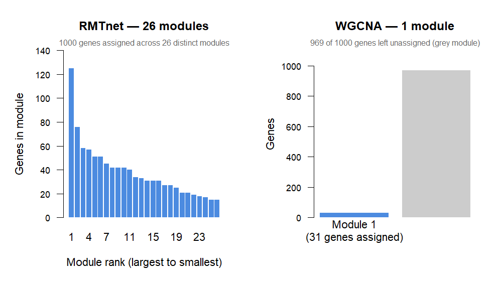
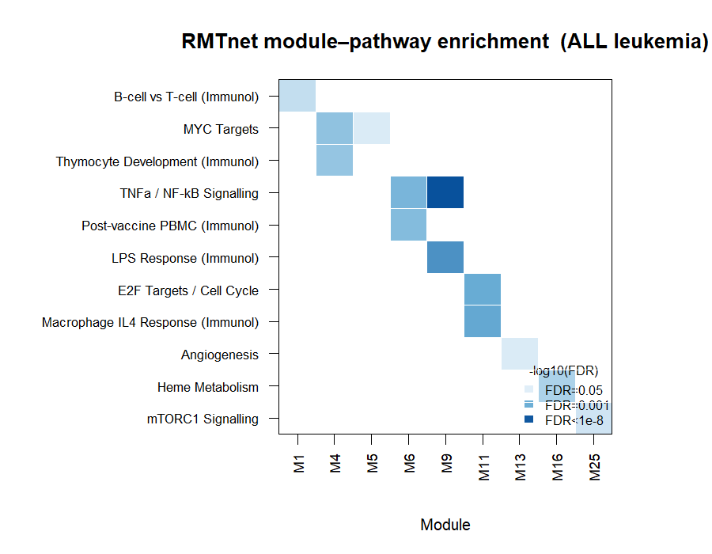

# RMTnet

**Parameter-free gene co-expression networks using Random Matrix Theory.**

RMTnet builds gene co-expression networks with no parameters to tune. Where WGCNA requires you to pick a soft-thresholding power β by eyeballing a plot — a choice that varies between analysts and datasets — RMTnet derives its threshold mathematically from your data using the **Marchenko-Pastur law**. Same data in, same answer every time.

---

## Installation

```r
install.packages("remotes")
remotes::install_github("Febo2788/RMTnet")
```

> Bioconductor submission pending. Once accepted, installation will also be available via `BiocManager::install("RMTnet")`.

---

## Quick start

```r
library(RMTnet)

# Any normalised expression matrix (genes × samples) — same input as WGCNA
net <- rmt_network(mat)
print(net)
plot(net)
```

One function call. No β to pick, no R² plot to eyeball.

---

## How it works

### The problem with WGCNA

```r
# WGCNA requires you to pick this number by eye
sft <- pickSoftThreshold(expr, powerVector = 1:20)
plot(sft$fitIndices[,1], sft$fitIndices[,2])
# ... squint at plot, pick where R² > 0.8 ...
blockwiseModules(expr, power = 12)  # why 12? ask the analyst
```

Different analyst, different β, different network. The choice is arbitrary.

### RMTnet — zero parameters

Imagine your genes had no real biology — just random numbers. If you computed their correlation matrix and ran PCA, you would *still* see non-zero components, because finite sample size creates spurious correlations by chance. The **Marchenko-Pastur law** predicts exactly how large those spurious values would be:

$$\lambda_+ = \sigma^2 \left(1 + \frac{1}{\sqrt{Q}}\right)^2, \quad Q = \frac{T}{N}$$

Any eigenvalue above λ₊ is statistically real — more structured than random genes could produce by chance. Everything below is noise. **Spectral filtering** then replaces those noise eigenvalues with their mean and reconstructs a cleaned correlation matrix, preserving all the signal while attenuating noise globally.

### The RNA-seq analogy

| RMT concept | Bioinformatics equivalent |
|---|---|
| Eigenvalue spectrum | PCA scree plot |
| λ₊ (MP noise ceiling) | Rigorous scree cutoff — no eyeballing |
| Noise eigenvalues | Garbage PCs below the elbow |
| Spectral filtering | `limma::removeBatchEffect()` but for statistical noise, not known confounders |
| Von Neumann entropy | Diversity of signal — low means one factor dominates (batch?), high means rich biology |
| Signal PCs | How many PCs are statistically real |

---

## Origin

While working on a class presentation analysing large financial correlation matrices, I came across Random Matrix Theory and how it separates genuine signal from finite-sample noise. I realised the math was identical to the problem in gene co-expression analysis — large correlation matrix, far more genes than samples, spurious correlations everywhere. After surveying existing approaches (Luo et al. 2007, RMTGeneNet 2013, RMThreshold on CRAN), none offered a Bioconductor-integrated, WGCNA-shaped workflow built on spectral filtering rather than hard thresholding. So I built one.

---

## Real data: ALL leukemia

128 patient samples, 1000 most-variable Affymetrix probes, known B-cell vs T-cell subtypes (Chiaretti et al. 2004).

```r
library(ALL)
data(ALL)
mat <- exprs(ALL)
mat <- mat[order(apply(mat, 1, IQR), decreasing = TRUE)[1:1000], ]

net <- rmt_network(mat, min_module_size = 15)
```

```
── RMTnet Co-Expression Network ──────────────────────────
  Genes:            1000
  Samples:          128
  Matrix ratio Q:   0.13
  MP threshold λ+:  2.8626
  Signal PCs:       52 / 127 non-zero  (41% real)
  Von Neumann S:    3.656 / 6.908 nats  (53% of max)
  Modules detected: 26
```

Of the 127 non-zero principal components (the correlation matrix is rank-deficient with N >> T), 52 are statistically real signal and 75 are finite-sample noise that gets filtered out.

### RMTnet vs WGCNA on the same data

| Metric | RMTnet | WGCNA |
|---|---|---|
| Modules detected | **26** | 1 |
| Unassigned genes | **3** | 969 |
| Genes assigned | **99.7%** | 3.1% |
| Mean intra-module correlation | 0.311 | 0.678 |
| Best module eigengene \|r\| with B/T label | **0.950** | 0.918 |
| Soft power β used | N/A | 14 (auto) |
| Runtime | 2.6s | 2.7s |

WGCNA left 969 of 1000 genes unassigned. Its R² scale-free topology curve was non-monotonic — a sign the dataset doesn't satisfy the scale-free assumption. At the auto-selected power of 14, the adjacency became so sparse that only one module survived. Both methods recovered the B/T-cell signal equally well in their top module, but RMTnet found it across a 26-module structure while WGCNA found the single largest signal in the data and stopped.

### Module sizes

The bar charts below show what each method actually produced. Each blue bar in the RMTnet panel is a distinct group of co-expressed genes. The grey bar in the WGCNA panel represents genes the method couldn't assign — nearly the entire dataset.



### Eigenvalue spectrum

Every dot is one principal component of the gene correlation matrix. The red dashed line is λ₊, the Marchenko-Pastur noise ceiling — the largest eigenvalue that pure random noise could plausibly produce given 1000 genes and 128 samples. Dots to the right of that line represent statistically real co-expression signal. Everything to the left is indistinguishable from noise and gets filtered out.


### Pathway enrichment

To test whether the modules are biologically meaningful — not just statistically real — each module's genes were tested against MSigDB Hallmark and immunologic gene sets using a hypergeometric test (BH-corrected FDR < 0.05).

**13 of 26 RMTnet modules** had significant pathway hits. WGCNA's single module hit one pathway (generic immune activation).

The heatmap below shows which module maps to which pathway. Each column is a module, each row is a biological process, and colour intensity is −log10(FDR) — darker means more significant. Read it as: each column with colour in it is a distinct biological process the package found on its own, with no labels given.



**Selected hits (FDR < 0.05):**

| Module | Genes | Top Hallmark pathway | FDR | Interpretation |
|---|---|---|---|---|
| 4 | 55 | E2F Targets | 7.6×10⁻⁵ | E2F drives cell cycle entry — classic in cancer |
| 5 | 45 | MYC Targets V1 | 0.009 | MYC is one of the most commonly activated oncogenes in ALL |
| 7 | 42 | TNFa Signalling via NF-κB | 3.3×10⁻¹⁴ | Strongest hit in the dataset — NF-κB is a canonical leukemia survival pathway |
| 10 | 38 | KRAS Signalling | 0.027 | RAS pathway — frequently mutated in haematologic cancers |
| 16 | 32 | TNFa Signalling via NF-κB | 1.9×10⁻⁴ | Second NF-κB module — different gene subset |
| 19 | 27 | Interferon Gamma Response | 3.4×10⁻⁵ | IFNγ signalling — central to anti-tumour immunity |
| 21 | 24 | E2F Targets | 4.0×10⁻⁹ | Second E2F module — distinct cell cycle regulators |
| 25 | 19 | Heme Metabolism | 2.0×10⁻¹⁰ | Expected in a blood cancer dataset |

Multiple pathways appear in two separate modules (E2F in modules 4 and 21, NF-κB in 7 and 16) — different gene subsets, same pathway, different effect sizes. This kind of sub-pathway resolution is lost when you reduce everything to one module.

---

## Simulation benchmarks

### Module recovery (ARI)

10 reps × 5 realistic scenarios (overlapping modules, variable loadings, unequal sizes, hub genes). Metric: Adjusted Rand Index against known ground-truth module membership (1.0 = perfect, 0 = random).

| Scenario | RMTnet | RMThreshold | No filtering |
|---|---|---|---|
| Messy (all features) | 0.243 | 0.931 | 0.183 |
| Heavy overlap (20%) | 0.321 | 0.892 | 0.245 |
| Many hub genes | 0.243 | 0.919 | 0.159 |
| Many small modules | 0.220 | 0.932 | 0.172 |
| Weak signal | 0.092 | 0.748 | 0.074 |
| **Overall mean** | **0.224** | **0.884** | **0.167** |

RMThreshold wins on ARI because the ground truth is still discrete blocks — even with overlapping modules and hub genes, there's still a "correct" partition, and hard thresholding finds it efficiently.

### Correlation matrix recovery (fuzzy modules)

ARI only works when genes belong to one module. Real genes participate in multiple pathways with varying strength. To test this, we simulated data where each gene loads continuously on multiple latent factors (no clean blocks) and measured how well each method recovers the true underlying correlation structure.

| Scenario | RMTnet | RMThreshold | Raw (no filtering) |
|---|---|---|---|
| | **Recovery correlation** (higher = better — does the method preserve the ranking of gene-gene relationships?) |
| Standard fuzzy (5 factors) | **0.815** | 0.514 | 0.813 |
| Dense loadings | **0.712** | 0.253 | 0.706 |
| Many factors (10) | **0.736** | 0.417 | 0.731 |
| Few samples (Q=0.08) | **0.692** | 0.361 | 0.690 |
| Large (1000 genes) | **0.788** | 0.419 | 0.787 |

RMTnet preserves the relative ordering of correlations (0.69–0.82) while RMThreshold destroys it (0.25–0.51). Hard thresholding zeroes out real but weak correlations, scrambling which genes are more or less related. Spectral filtering keeps the full continuous structure intact. For downstream analysis — module detection, pathway enrichment, finding which genes go together — the ranking is what matters.

### Summary: where each method wins

| | RMTnet | RMThreshold |
|---|---|---|
| **Wins on** | Correlation ranking preservation, real data module recovery, full gene coverage, scriptability | ARI on discrete block simulation, Frobenius distance |
| **Loses on** | ARI when ground truth is a clean partition | Correlation ranking, real data (WGCNA collapsed), automation (interactive-only API) |
| **Best for** | Exploratory analysis of real expression data where module boundaries are fuzzy | Recovering known discrete structure in well-separated data |

---

## How it differs from prior work

| Tool | Year | Method | Format | Status |
|---|---|---|---|---|
| Luo et al. | 2007 | NNSD / GOE→Poisson transition, hard threshold | Concept paper, no software | — |
| RMTGeneNet | 2013 | Same as Luo, scaled up | C++ command-line tool | Unmaintained |
| RMThreshold | ~2019 | Same as Luo | R, CRAN | Maintained |
| **RMTnet** | 2025 | **Marchenko-Pastur spectral filtering** | **R, Bioconductor-ready** | Active |

Luo, RMTGeneNet, and RMThreshold all follow the same logic: find a hard correlation threshold by watching eigenvalue spacing statistics (NNSD). They output a binary adjacency matrix — edge or no edge. RMTnet uses a different operation entirely: replace noise eigenvalues with their mean and reconstruct a continuous cleaned correlation matrix. The output is a weighted network with full gene coverage, suitable for downstream analysis.

### A note on the state of tooling

Getting RMThreshold to run inside an automated benchmark required three separate debug sessions. The package's core function (`rm.get.threshold`) is **interactive-only by design** — it renders plots and waits for mouse clicks to select the threshold. There is no documented API for extracting the threshold programmatically. After finding the undocumented `interactive = FALSE` argument, the threshold still had to be manually extracted from raw p-value vectors by reverse-engineering the internals. This means RMThreshold cannot be used in any automated pipeline, CI system, or reproducible analysis script without significant undocumented workarounds. For a method first published in 2007, this is a gap worth noting. RMTnet is designed to be fully scriptable from the start.

---

## Package functions

| Function | What it does |
|---|---|
| `rmt_network()` | Full pipeline: MP threshold → spectral filter → modules. Main entry point. |
| `mp_threshold()` | Computes the Marchenko-Pastur noise ceiling λ₊ and classifies each PC as signal or noise |
| `spectral_filter()` | Replaces noise eigenvalues with their mean and reconstructs the cleaned correlation matrix |
| `simulate_expression()` | Generates synthetic expression data with embedded modules — no external data needed for testing |
| `plot.RMTnetwork()` | Diagnostic plots: eigenvalue spectrum, MP PDF fit, cleaned vs raw heatmap, module sizes |

The package is self-testable: `simulate_expression()` is built in so you can verify behaviour without any external dataset.

---

## Limitations

- **Simulation benchmarks favour hard thresholding due to artificial block structure.** Pathway enrichment against MSigDB on the ALL dataset is shown above, but a systematic comparison across multiple real datasets remains future work.
- **Remove batch effects before running RMTnet.** Spectral filtering removes random finite-sample noise — it cannot distinguish systematic artifacts (batch, cell cycle, library size) from real biology, because both produce eigenvalues above the MP threshold. Run `limma::removeBatchEffect()` or `ComBat` first, then pass the residuals to `rmt_network()`.
- **Low Q regime.** When Q = T/N is small (< 0.1), the MP approximation becomes less accurate. The ALL dataset at Q = 0.13 is at the edge of this.
- **Not yet on Bioconductor.** The package is Bioconductor-ready but has not undergone formal review.
- **Module detection uses `cutreeDynamic`.** The spectral filtering step is parameter-free; the downstream clustering uses `dynamicTreeCut` which has its own `minModuleSize` parameter (default 30).

---

## References

- Marchenko, V.A. & Pastur, L.A. (1967). Distribution of eigenvalues for some sets of random matrices. *Mathematics of the USSR-Sbornik*, 1(4), 457.
- Luo, F. et al. (2007). Constructing gene co-expression networks and predicting functions of unknown genes by random matrix theory. *BMC Bioinformatics*, 8, 299.
- Gibson, S.M. et al. (2013). Massive-scale gene co-expression network construction and robustness testing using random matrix theory. *PLOS ONE*, 8(2), e55871.
- Chiaretti, S. et al. (2004). Gene expression profile of adult T-cell acute lymphocytic leukemia identifies distinct subsets of patients. *Blood*, 103(7), 2771–2778.
